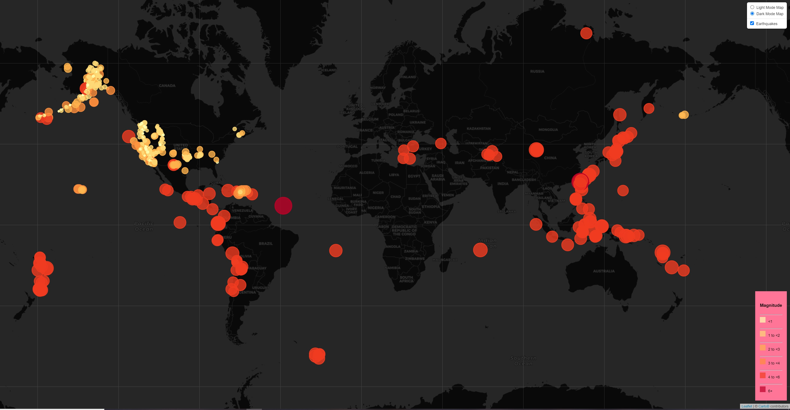

# Leaflet-challenge

# Part 1: USGS Earthquakes
Made a leaflet.js map using USGS' Earthquake's free API. This dataset pulls the past week (https://earthquake.usgs.gov/earthquakes/feed/v1.0/summary/all_week.geojson)

# Part 2: Tectonic Plates Layer
Added in a tectonic plates layer from Fraxen (see: https://github.com/fraxen/tectonicplates). 

# Features
Both maps use the light and dark maps from CartoB's free tile maps. All layers can be selected on and off. They also contain a legend concerning earthquake magnitude and their markers scale according to size. 
They were also scaled to show all of the small tremors more clearly but tremors are not significant to people. until they are 4.5+. 

# Analysis 
As expected, the overwhelming majority of tremors occur around tectonic plates, especially in the Pacific Ring of Fire where a large number of subduction zones have caused numerous storms, tsunamis, earthquakes and eruptions.   
